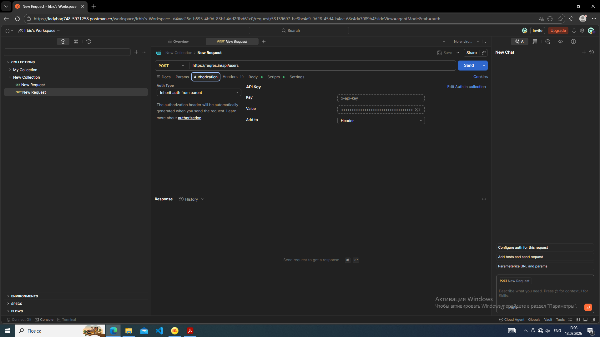
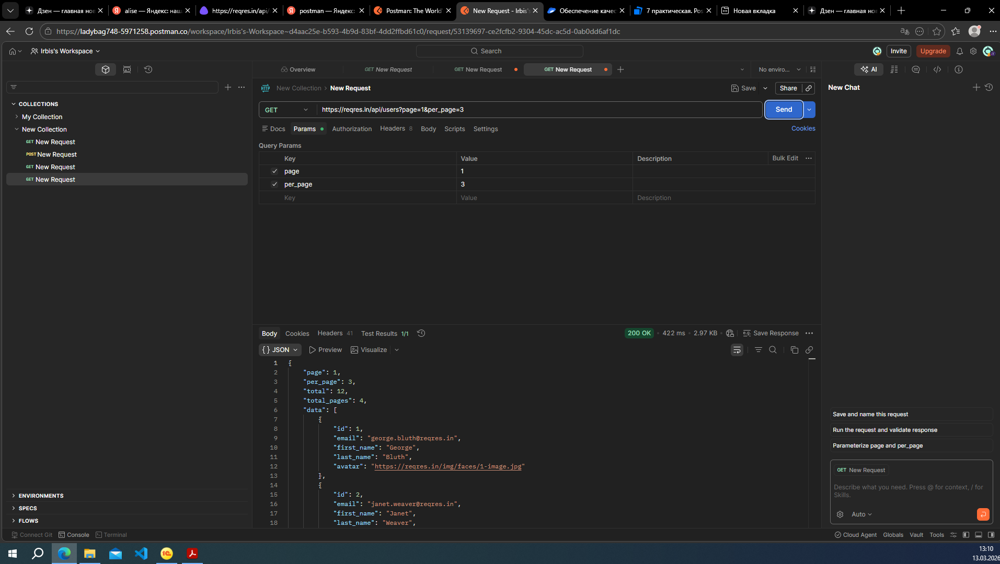
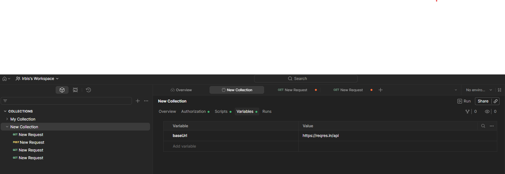
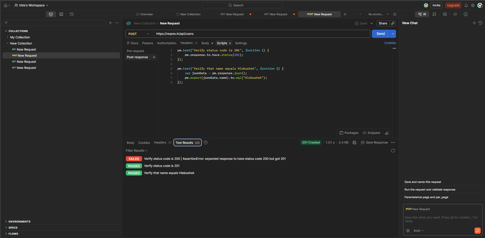
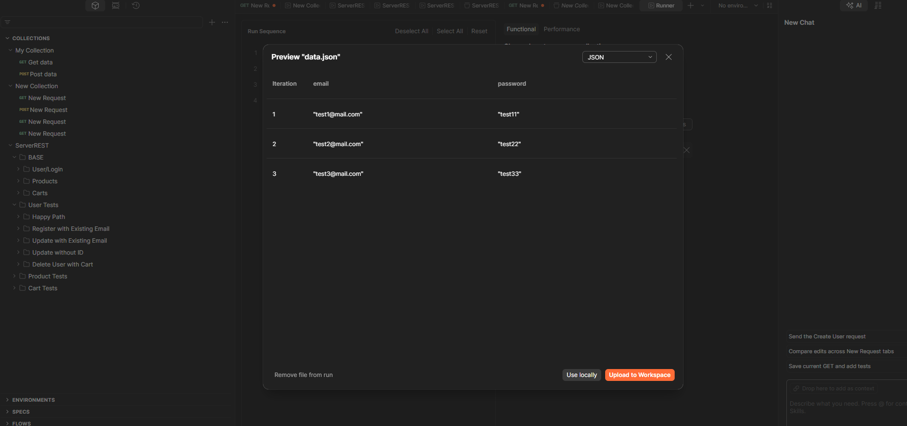
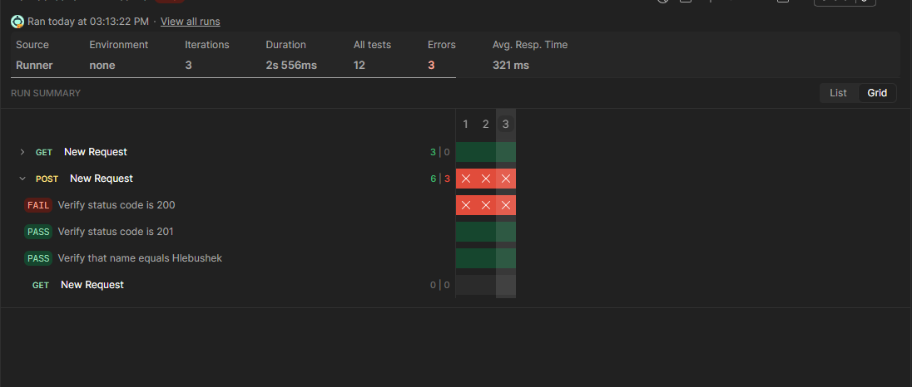
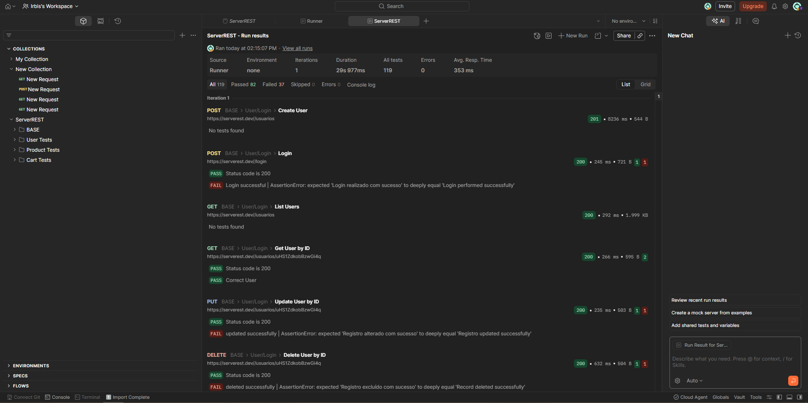
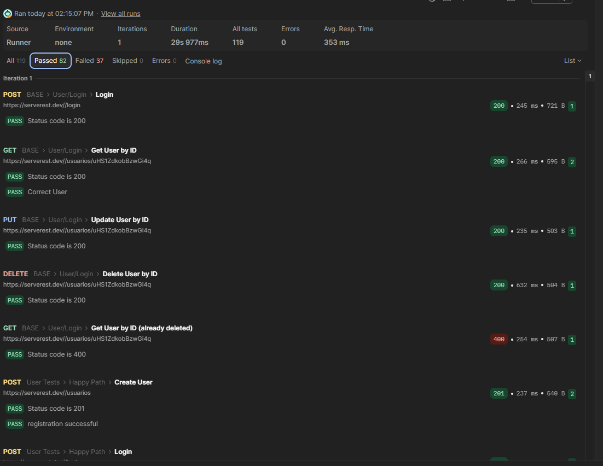
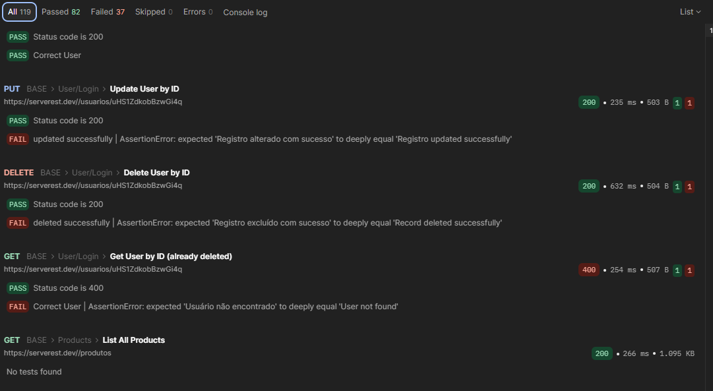

# Практическая работа 7
## Выполнили Пацер и Михайлова

## Задание 1
- выбор публичного API: https://reqres.in/;
- создание ключа:

- создание коллекции с 3 запросами:

- GET https://reqres.in/api/users?page=2 - запрос с параметрами пагинации
- GET https://reqres.in/api/users/2 - один объект по индетификатору
- GET https://reqres.in/api/users - список объектов

- создание переменной baseUrl:

- написание простых тестов:

- импортирование файла json и запуск тестов:

## Задание 2-3
- импорт готовой коллекции и запуск сценариев:

Выполняющиеся тесты:

- вкладка Tests в Postman позволяет писать скрипты на JavaScript для автоматической проверки ответов API. Код выполняется после получения ответа от сервера.
Базовый скрипт (шаблон):
pm.test("Название теста", function () {
  // Логика проверки
  pm.expect(условие).to.be.true;
});

- тело ответа (Body) зависит от типа запроса и логики API. Основные форматы:
- успешный ответ (статус‑коды 200–201)
- ответ с ошибкой (статус‑коды 4xx–5xx)

